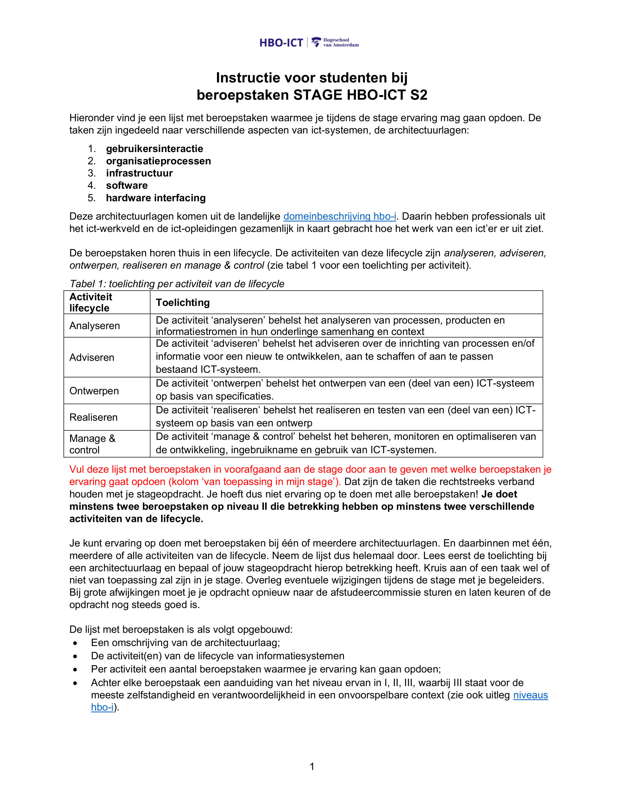
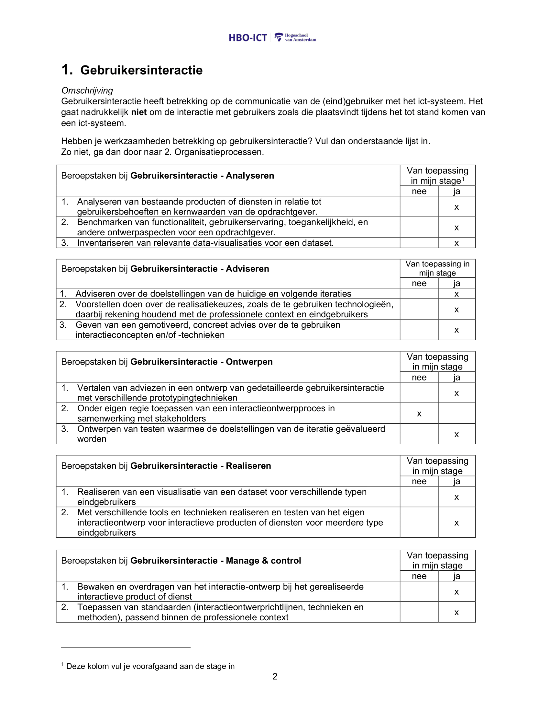
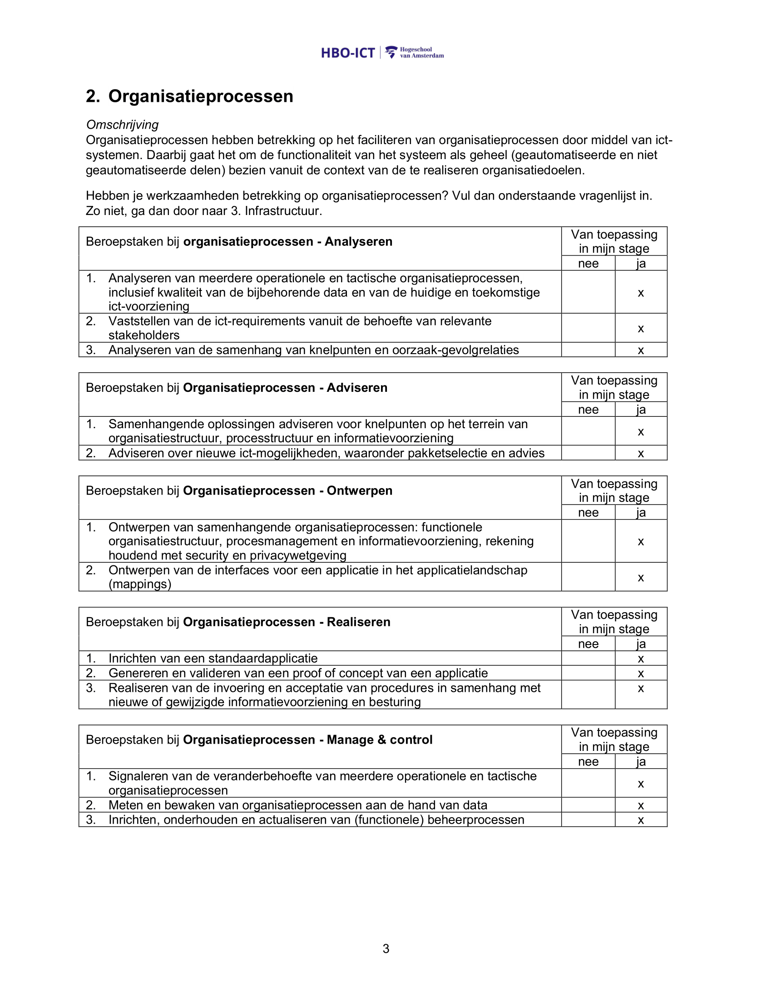
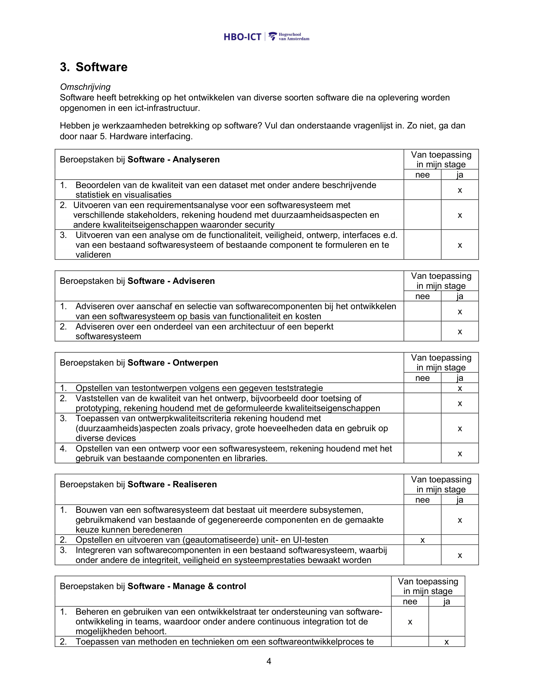
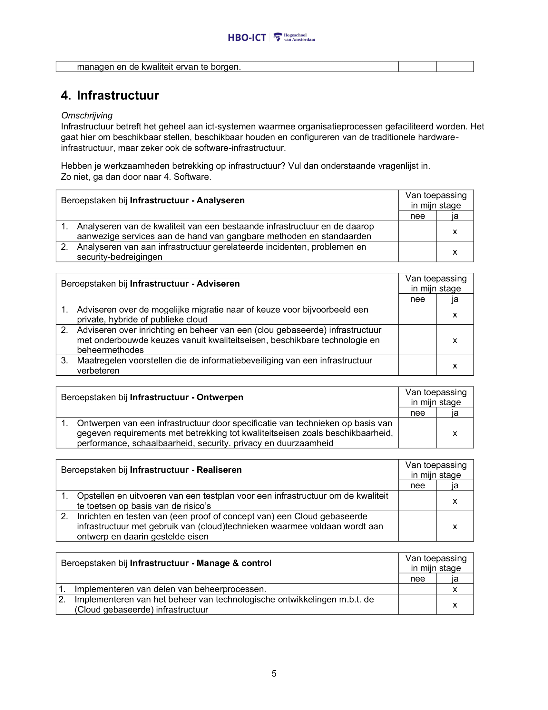
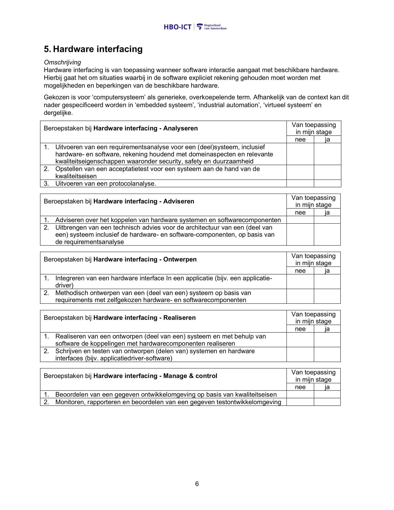
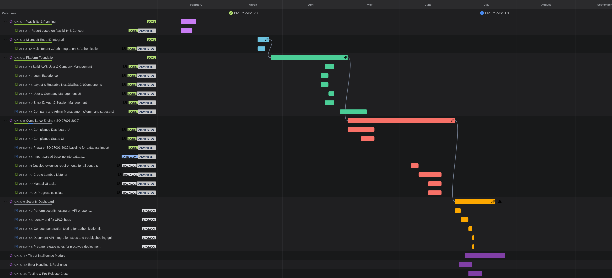

## Stageportfolio SECIAN 

## Anwar Muradin 

#### 0683331295 

### HvA, HBO-ICT 

## Stagedocent: Juriaan Vogelzang 

## Bedrijfsbegeleider: Amar Ritoe 

### Stageperiode: 2025, semester 


---
## Inhoudsopgave
---
1. [CV](#1-cv)
2. [Inleiding](#2-inleiding)
3. [Beroepstakenlijst](#3-beroepstakenlijst)
4. [Professioneel vakmanschap](#4-professioneel-vakmanschap)
   - STARR, beroepstaak 1
   - STARR, beroepstaak 2
5. [Onderzoekend vermogen](#5-onderzoekend-vermogen)
   - STARR-formulier bij onderzoeksrapport
   - Link en beoordelingsformulier onderzoeksrapport
   - Ander bewijs (feasibility study)
6. [Toekomstgericht organiseren](#6-toekomstgericht-organiseren)
   - Organisatorische context (STARR)
   - Procesmanagement (STARR + bewijs)
   - Ethiek (dilemma's)
7. [Doelgericht interacteren](#7-doelgericht-interacteren)
   - Mondeling communiceren (presentatie)
   - Samenwerken (STARR)
   - Partners (beoordeling bedrijfsbegeleider)
8. [Persoonlijk leiderschap](#8-persoonlijk-leiderschap)
   - SOP origineel
   - SOP geactualiseerd


---
### 1. CV
---

## **Anwar Muradin**
**Email:** [anwar.muradin@gmail.com](mailto:anwar.muradin@gmail.com)  
**Phone:** +31683331295  
**Address:** Kleiburg 420, 1104EA, Amsterdam  

---
### **Education**

#### **Hogeschool van Amsterdam** (Amsterdam)  
**HBO-ICT - Computer Engineering**  
- Focus: Embedded hardware and software
- **Duration:** September 2023 – July 2027  

#### **Haagse Hogeschool** (Den-Haag)  
**HBO-ICT - Software Engineering**  
- Focus: Business & Data Management, Network & Systems Engineering, Information Security Management, Innovative Development  
- **Duration:** August 2022 – July 2023  

#### **Haarlemmermeerlyceum** (Hoofddorp)  
**HAVO - Bilingual Education**  
- Graduated: June 2022  
- International Baccalaureate (IB) English: Grade 9  

#### **OBS Merlijn** (Nieuw-Vennep)  
**Basisschool**  
- **Graduated:** June 2016  
- **CITO Score:** 548/550  

---
### **Work Experience**

#### **Fiksi**  
**Technical Consultant**  
- Provided hardware and software consultancy services.  
- Achieved an average personal customer rating of **9.5** (references available).
- **Duration:** Dec 2023 - Present

#### **Hamilton Bright**  
**Sales Associate & Powerservice Specialist**  
- Specialized in sales and technical support in TV, computer, and telecom departments.  
- Completed courses in Powerservice and Cybersecurity.  
- **Duration:** Feb 2023 - Jun 2023

#### **MediaMarkt** (Hoofddorp)  
**Sales Associate & Powerservice Specialist**  
- Sales experience in TV, computer, and telecom departments.  
- Expertise in troubleshooting, repairs, and installations.  
- **Duration:** Jul 2022 – Feb 2023

---
### **Key Projects**

#### **1. Proxmox PVE Cluster**  
- **Objective:** Built a Proxmox Virtual Environment (PVE) cluster running on two nodes to manage and host virtual machines for various applications.  
- **Key Features:**  
  - Virtualized infrastructure supporting multiple VMs.  
  - Scalable and efficient resource management.  
- **Results:** Established a robust platform for experimentation and efficient utilization of hardware resources.  

#### **2. Personal Media Server**  
- **Objective:** Created a centralized media server hosted on a virtual machine within the Proxmox PVE cluster.  
- **Key Features:**  
  - Streamlined access to video, audio, and other file formats.  
  - Cross-device compatibility for seamless media consumption.  
- **Tools Used:** Jellyfin, OpenMediaVault, Docker.  
- **Results:** Improved organization and accessibility of personal media content.  

#### **3. LLM Chat AI Server**  
- **Objective:** Set up a server hosting a local Large Language Model (LLM) for personal research and development.  
- **Key Features:**  
  - Enabled offline AI capabilities for natural language processing tasks.  
  - Enhanced learning and experimentation with language models.  
- **Tools Used:** Python, PyTorch, Hugging Face Transformers.  
- **Results:** Gained hands-on experience with hosting and fine-tuning LLMs for various use cases.  

#### **4. Remote Gaming Machine**  
- **Objective:** Developed a virtual machine optimized for high-performance gaming, accessible remotely from low-end hardware.  
- **Key Features:**  
  - GPU pass-through for enhanced graphical performance.  
  - High-quality game streaming to low-end devices.  
- **Tools Used:** Parsec, NVIDIA Virtual GPU.  
- **Results:** Provided a cost-effective gaming solution with minimal hardware requirements.  
 
---
### **Diplomas & Certifications**

- HAVO  
- HBO Bachelor Propedeuse in HBO-ICT  
- MediaMarkt Powerservice Certification  
- MediaMarkt Cybersecurity Certification  
- Calman Calibration for Screens and TVs  
- English International Baccalaureate  

---
### **Skills**

- Technical troubleshooting and repair  
- Communication and customer support  
- Multitasking and initiative  
- Diagnostic expertise  

---
### **Languages**

- **Dutch**: Native  
- **English**: Native  

---
### **Hobbies & Interests**

- Developing Audio/Video solutions for studio and entertainment usage.
- Assisting with troubleshooting and network support  
- Discovering and sharing the operation and inner-workings of technology
- Car repair and modification
- Photography

---
### 2. Inleiding
--- 

Mijn stage vond plaats bij **SECIAN**, een cybersecuritybedrijf dat diensten levert op het gebied van beveiliging, compliance en risicomanagement. SECIAN richt zich op het toegankelijk maken van complexe informatie voor niet-technische gebruikers in organisaties die gebruikmaken van cloudplatformen zoals Microsoft 365, Google Workspace en AWS.

Tijdens mijn stage werkte ik aan de technische kant van een nieuw product: een **real-time SaaS-dashboard** voor het visualiseren van compliance-informatie. De uitdaging was om compliancegegevens uit verschillende platformen op een uniforme en veilige manier inzichtelijk te maken, met schaalbaarheid en gebruiksvriendelijkheid als kernvoorwaarden.

Mijn werkzaamheden zijn onder te verdelen in drie hoofdfases:

1. **Onderzoeksfase**  
    Ik onderzocht hoe compliance-informatie technisch toegankelijk gemaakt kon worden vanuit platformen zoals Microsoft 365 (via de Graph API), AWS CloudTrail en Google Admin SDK. Ik bracht de mogelijkheden en beperkingen van deze API's in kaart, en analyseerde hoe authenticatie, data-extractie en permissies per platform geregeld waren. De resultaten werden gebundeld in een technische feasibility study.
    
2. **Ontwerpfase**  
    Op basis van de onderzoeksresultaten ontwierp ik samen met de opdrachtgever een back-endarchitectuur. We maakten keuzes rond federated login (Microsoft Entra), versleutelde opslag via DynamoDB, en gebruikersbeheer via rolverdeling. Een belangrijk onderdeel was het ontwikkelen van een parser die logs uit verschillende platformen kon normaliseren naar een intern datatype, zodat analyses platformonafhankelijk uitgevoerd konden worden.
    
3. **Uitvoeringsfase**  
    In deze fase werkte ik aan de implementatie van de back-end. Ik bouwde een prototype op basis van AWS (Cognito, DynamoDB, API Gateway), en werkte aan veilige authenticatie, versleutelde dataverwerking en endpointbeveiliging. Daarnaast richtte ik versiebeheer in via GitHub, ontwierp ik een branchestructuur met semantische versieing, en begeleidde ik mijn opdrachtgever bij het opzetten van een scrum-achtige werkwijze met Jira, stand-ups en taakbeheer.
    

De volledige stageperiode liep van februari t/m juni 2025. Gedurende deze tijd werkte ik grotendeels zelfstandig, met regelmatige sparmomenten en afstemming met mijn opdrachtgever. De samenwerking verliep pragmatisch, met veel ruimte voor technische verdieping en initiatief.


---
### 3. Beroepstakenlijst
--- 







---
### 4. Professioneel vakmanschap
--- 

### 1. STARR, beroepstaak 1

* Het bewijs betreft een beroepsproduct dat ik samen met anderen heb gemaakt, namelijk: Het ontwerp van een back-end implementatie op basis van de front-end van SECIAN's APEX.

#### STARR-formulier 1 – Ontwerpen van IT-oplossingen (niveau 2)

**S – Situatie (Beroepstaak 1):**  
Ik werkte aan een dashboard app voor SECIAN, een cybersecuritybedrijf onder leiding van Amar Ritoe. De opdracht had het karakter van een pilotproject, bedoeld om te verkennen wat technisch haalbaar was binnen het bedrijf. Het was onderdeel van een breder idee om interne processen te automatiseren, maar stond qua uitvoering redelijk op zichzelf. De focus lag hierbij op het realiseren van een functioneel prototype, inclusief de technische en visuele basis.

**T – Taak (Beroepstaak 1):**  
Mijn taak was om een haalbaarheidsstudie uit te voeren, de structuur en logica van het versiemodel te ontwerpen (mockup, alpha, beta, release), en de front-end mockup te ontwikkelen. Dit vereiste het vertalen van vage ideeën naar een concreet ontwerp. Deze ontwerpfase was uitdagend doordat het project weinig bestaande kaders had en ik veel beslissingen zelf moest onderbouwen.

**A – Aanpak (Beroepstaak 1):**  
Ik begon met een haalbaarheidsanalyse waarin ik onderzocht welke technische keuzes binnen de context van SECIAN realistisch en veilig waren. Daarna tekende ik met pen een datastructuur- en flowdiagram op papier, zodat de opdrachtgever snel overzicht kreeg en zich kon herkennen in de logica. Dit hielp om het ontwerp visueel en begrijpelijk te maken. Vervolgens werkte ik op basis daarvan een tijdlijn en een kanban-board uit als voorstel voor de verdere uitvoering. Ik documenteerde de stappen in het ontwerptraject en hield de opdrachtgever betrokken bij de keuzes.

**R – Resultaat (Beroepstaak 1):**  
Het resultaat was een helder ontwerp en een visueel uitgewerkte mockup, die als basis kon dienen voor de verdere ontwikkeling van de applicatie. De structuur van de versieopbouw is overgenomen voor het ontwikkelproces. De opdrachtgever beoordeelde het ontwerp positief en vond dat het een goed fundament bood voor de realisatie.

**R – Reflectie (Beroepstaak 1):**  
In dit project leerde ik hoe belangrijk het is om de wensen van een opdrachtgever helder en praktisch te vertalen naar een concreet ontwerp. De opdrachtgever gaf aan wat hij wilde en hoe het eruit moest zien. Door zijn feedback letterlijk terug te koppelen en hem actief te laten kiezen tussen details, hield ik hem betrokken en voorkwam ik misverstanden. Daarna maakte ik een schets met pen om de datastroom visueel uit te leggen. Dat hielp om op één lijn te komen.  
De daaropvolgende haalbaarheidsstudie bood een goede onderbouwing voor de technische keuzes, en werd goedgekeurd door de opdrachtgever. Op basis daarvan heb ik onze eisen geanalyseerd, een plan van aanpak opgesteld (met kanban-board en tijdlijn), en ben ik gestart met de uitvoering. In toekomstige projecten wil ik deze aanpak behouden: eerst visueel afstemmen, dan gestructureerd plannen, zodat iedereen die betrokken is bij het ontwikkelen grip houden op het proces.


---
##  Bewijs:


## Ontwerpdocument 1
---
### 🧱 **Backend Infrastructure**

- Set up backend repo and project structure
    
- Configure environment variables
    
- Set up AWS DynamoDB
    
- Connect backend to DynamoDB
    
- Set up User mgmt (e.g., Cognito)

    
- Prepare deployment script or test deploy (AWS)
    

---

### 🔐 **Authentication & Session Management**

- Handle Microsoft Entra ID login
    
- Store access & refresh tokens
    
- Save session to `sessions` table
    
- Associate session with a user and company
    
- Add token refresh and session expiry middleware
    
- Protect routes with session-based access
    

---

### 👤 **User & Company Management**

- Create user on first login
    
- Store user role (`admin`, `user`)
    
- Create and store company data
    
- Associate users with companies
    

---

### 📊 **Graph API Integration & Data Storage**

- Fetch Microsoft Graph API data (users, sign-in logs)
    
- Create tables like `entra_users`, `entra_signins`
    
- Store fetched data scoped to `company_id`
    
- Expose simple read APIs (e.g., `/entra/users`)
    

---

### ✅ **Compliance Logic**

- Define schema for `compliance_controls`
    
- Write first compliance rule (e.g., MFA enabled for all users)
    
- Build logic to match stored data with compliance rules
    

---

### 🧪 **Testing & Validation**

- Test login → session → data fetch → storage flow
    
- Validate data accuracy and error handling
    

---

## Ontwerpdocument 2
---

### 🧱 Database Architecture (AWS DynamoDB)

#### 📚 Baseline Database (Public)

- **Schema:** `iso27001_baseline`
    
- **Tables:**
    
    - One table per ISO 27001:2022 chapter, including subsections/subcontrols.
        
    - Each table stores:
        
        - `section_id` (PK),
            
        - `title`,
            
        - `description`,
            
        - `control_type`,
            
        - `expected_evidence`, etc.
            

#### 🔐 Company Compliance Database (Private)

- **Schema:** `company_compliance`
    
- **Tables:**
    
    - Mirrors baseline schema (one table per ISO 27001 section)
        
    - Fields include:
        
        - `entry_id` (PK), `company_id` (FK),
            
        - `status` (`compliant`, `non-compliant`, `in-progress`, `not-applicable`),
            
        - `notes`, `evidence_links`, `last_updated`, etc.
            

#### 👥 User & Company Tables

- `companies`: `company_id` (UUID PK), `name`, `created_at`
    
- `company_admins`: `admin_id`, `company_id` (FK), `user_id` (FK)
    
- `company_users`: `user_id`, `company_id` (FK), `role`, `created_at`
    

> All relations use UUIDs for secure and unique identification.

---

### 🛠️ **Comparison Logic**

- **Automated Checks:**
    
    - Use Entra ID / Microsoft Graph API to pull live data.
        
    - Validate data against baseline controls (e.g., password policy, MFA).
        
- **Manual Submission:**
    
    - Companies provide evidence via API or dashboard.
        
    - Stored in `company_compliance` tables.
        

---

## Ontwerpdocument 3
---

### Microsoft Graph API Feasibility Report  
**Scope:** Retrieve authentication method configurations (e.g., MFA) and Exchange/Outlook Safe Links status  
**Relevant Controls:**  
- ISMS-68 – Secure Authentication  
- ISMS-70 / ISO27001 – Protection Against Malware  

---

#### 1. Authentication Methods (MFA Enabled) – ISMS-68

##### ✅ Feasible via Microsoft Graph API

**Purpose:** Determine whether users have MFA enabled and view their authentication methods.

**Endpoints:**
- `GET /users/{user-id}/authentication/methods`  
  Retrieves all registered authentication methods per user.

- `GET /auditLogs/signIns`  
  Provides sign-in logs including `authenticationDetails` (indicates MFA usage).

**Required Permissions:**
- `User.Read.All`
- `AuditLog.Read.All`
- `Reports.Read.All` (for logs)

**Notes:**
- Admin privileges are required.
- Azure AD Sign-In logs must be enabled.
- MFA enablement status is not a direct flag; you infer it by analyzing registered methods or conditional access/successful sign-in types.

---

#### 2. Exchange/Outlook Safe Links – ISMS-70 / ISO27001

##### ❌ Not Feasible via Microsoft Graph API (as of now)

**Purpose:** Validate if Safe Links (part of Defender for Office 365) are enabled to protect users from malicious URLs.

**Access Method:**  
Currently retrievable **only via Exchange Online PowerShell** using:

```powershell
Connect-ExchangeOnline
Get-SafeLinksPolicy
Get-SafeLinksRule
```


### Other policies can be checked once the database is populated and I can filter on (automated = true).
---
### 2. STARR, beroepstaak 2

*  Het bewijs betreft een beroepsproduct dat ik samen met anderen heb gemaakt, namelijk: Het realiseren van de ontworpen implementatie voor de back-end van SECIAN's APEX.

#### STARR-formulier 2 – Realiseren van IT-oplossingen (niveau 2)

**S – Situatie (Beroepstaak 2):**  
Voor dezelfde opdracht bij SECIAN ging ik na de ontwerpfase verder met het daadwerkelijk realiseren van de alpha-versie van de dashboard app. Dit gebeurde binnen een context waarin veiligheid belangrijker was dan snelheid. De opdrachtgever, Amar Ritoe, wilde een stabiel en foutloos werkend prototype.

**T – Taak (Beroepstaak 2):**  
Mijn taak was om de back-end van de applicatie te implementeren en ervoor te zorgen dat deze veilig, stabiel en functioneel was. Ook moest ik werken met databases, API-integraties en toegangsbeheer (MFA, rechtenstructuur). De uitdaging zat vooral in het combineren van technische complexiteit met veilige uitvoering.

**A – Aanpak (Beroepstaak 2):**  
Ik bouwde de back-end stap voor stap op, met focus op foutafhandeling, veilige dataopslag en API-koppelingen. Ik testte veelvuldig om stabiliteit te garanderen en maakte gebruik van console-logging en geautomatiseerde checks. Voor het ontwikkelproces gebruikte ik Kanban om mijn voortgang te structureren. Ik werkte grotendeels zelfstandig maar checkte geregeld in met de opdrachtgever.

**R – Resultaat (Beroepstaak 2):**  
Het resultaat was een werkende alpha-versie van de back-end, zonder fouten of waarschuwingen in de console. De basisfunctionaliteit draaide stabiel en voldeed aan de verwachtingen van de opdrachtgever. De implementatie werd goedgekeurd en wordt nu gebruikt als uitgangspunt voor verdere ontwikkeling.

**R – Reflectie (Beroepstaak 2):**  
Ik ben trots op hoe ik in korte tijd heb geleerd om een stabiele back-end op te zetten, met aandacht voor veiligheid en foutloos gedrag. Wat ik heb geleerd is dat tussentijdse updates belangrijk zijn voor de opdrachtgever, ook als het werk zelf gewoon op schema ligt. In toekomstige projecten zou ik oplevermomenten compacter en inhoudelijker maken om beter aan die behoefte te voldoen.

* Bewijs: Ik kan tijdens het assessment, of op aanvraag de (prive) repository laten zien en de applicatie in werking. Ik ben niet zeker over welk gedeelte van de (grote hoeveelheid) code en web config waardig bewijs is voor het hele product.

---
### 5. Onderzoekend vermogen
---
#### 1. STARR formulier bij het onderzoeksrapport

**Situatie:**  
Aan het begin van mijn stage bij SECIAN kreeg ik de opdracht om een SaaS-dashboard te ontwerpen dat real-time compliance-informatie toont aan niet-technische gebruikers. Dit moest werken met cloudplatforms zoals Microsoft 365, Google Workspace en AWS. Omdat deze platformen ieder hun eigen datastructuur, terminologie en authenticatie hebben, was het probleem zowel technisch als conceptueel uitdagend.

**Taak:**  
Mijn taak was om de technische haalbaarheid te onderzoeken van een schaalbaar dashboard dat gegevens uit deze platformen veilig kon ophalen, verwerken en tonen. Hiervoor moest ik eerst bepalen welke kennis ontbrak, geschikte methoden kiezen en op basis van onderzoek gefundeerde keuzes maken voor de eerste versie van het systeem.

**Actie:**  
Ik startte met een **feasibility study**, waarbij ik via documentanalyse en testimplementaties onderzocht:

- welke API’s de benodigde data konden leveren;
    
- welke authenticatieoplossingen per platform mogelijk waren (SSO, Entra, SAML, IAM);
    
- hoe compliance-eisen (GDPR, ISO27001, SOC2) vertaald konden worden naar een baseline die automatisch geëvalueerd kon worden;
    
- hoe logs uit verschillende platformen konden worden geharmoniseerd naar één intern datatype.
    

Gedurende het proces paste ik mijn aanpak aan op basis van nieuwe inzichten. Bijvoorbeeld: lokale opslag bleek te risicovol, dus verschoof de focus naar **versleutelde opslag in DynamoDB** en **rolgebaseerd gebruikersbeheer** via Microsoft Entra. Alternatieve oplossingen (zoals open source tools) werden bekeken maar verworpen vanwege onvoldoende veiligheid of schaalbaarheid.

**Resultaat:**  
Het onderzoek resulteerde in een ALPHA-prototype met:

- veilige, schaalbare architectuur;
    
- versleutelde opslag en incrementele dataverwerking;
    
- uniforme datamodellen voor logharmonisatie;
    
- een gebruikersstructuur die aansluit bij compliance-eisen.
    

Deze keuzes zijn verwerkt in het beroepsproduct en worden als fundament gebruikt voor verdere ontwikkeling. Mijn onderzoeksrapport werd volledig goedgekeurd (zie beoordelingsformulier).

**Reflectie:**  
Het uitvoeren van praktijkgericht onderzoek heeft me geleerd dat methodisch werken essentieel is bij complexe vraagstukken. Door kennisgebrek eerst in kaart te brengen en gericht bij te vullen, kon ik sneller tot bruikbare oplossingen komen. Ik heb bewust alternatieven overwogen en waar nodig bijgestuurd. Die aanpak wil ik blijven hanteren in toekomstige opdrachten met vergelijkbare onzekerheid.

	
#### 2. Link en Beoordelingsformulier 	
	
[Onderzoeksverslag.pdf](./evidence/Onderzoeksverslag.pdf)


### 3. Ander bewijs:

---
Meeting notes:

Compare company GRC with baseline (forms format)
Be able to connect using SSO from MS, Google workspace, AWS
Be able to import company data from MS, Google workspace, AWS
Be able to parse company data into comparable format for usage with baseline.
Be able to hook onto existing MDM to manage.

Baseline:
GDPR
CCPA
ISO2700

How much relevant data does MS, Google workspace, AWS allow to be exported?
What data is relevant for the comparison?
Why is this data relevant for the comparison?

Which tier (MS, Google workspace, AWS) provides what data?


---

## **Feasibility Study: Comparing Company GRC with GDPR, CCPA, ISO27001**

### **Mission**

This study explores the feasibility of:

1. Comparing a company’s governance, risk, and compliance (GRC) framework with three key baselines: **GDPR**, **CCPA**, and **ISO27001**.
2. Utilizing data export capabilities from **Microsoft 365**, **Google Workspace**, and **AWS**.
3. Parsing the exported data into a format that allows it to be measured against the selected baselines.
4. Integrating Single Sign-On (SSO) functionality for seamless connectivity with MS, Google Workspace, and AWS.

---

### **Section 1: What Data Can Be Exported?**

#### **Microsoft (MS) 365**

- **Exportable Data:**
    - User activity logs, file metadata, email headers, compliance reports, security assessments, and data loss prevention (DLP) records.
- **How to Export:**
    - Tools like PowerShell, Microsoft Graph API, and the Compliance Center.
- **Tiers Required:**
    - Microsoft 365 **E3** and **E5**, as well as **Azure AD Premium**, provide access to advanced compliance and security tools.

#### **Google Workspace**

- **Exportable Data:**
    - User data, Drive file metadata, admin activity logs, audit logs, and security reports.
- **How to Export:**
    - Admin Console (Data Export), Google APIs, and BigQuery for advanced analytics.
- **Tiers Required:**
    - Business Plus and Enterprise Plus offer full compliance data access.

#### **AWS**

- **Exportable Data:**
    - IAM (Identity and Access Management) data, S3 bucket metadata, security findings (GuardDuty), and Config logs.
- **How to Export:**
    - Via AWS CLI, CloudTrail logs, and Management Console.
- **Tiers Required:**
    - AWS Business Support and Enterprise Support plans unlock comprehensive compliance data.

---

### **Section 2: Relevant Data for Comparison**

The focus is on extracting and using data that directly correlates with GDPR, CCPA, and ISO27001 requirements.

|**Data Category**|**Why It’s Important**|
|---|---|
|**User Identity Data**|Critical for GDPR and CCPA compliance. Helps in ensuring user access rights, consent, and data retention.|
|**Access Logs**|Essential for ISO27001 audit trails and GDPR/CCPA tracking of user interactions with sensitive data.|
|**File Metadata**|Tracks data sharing and storage practices. Useful for checking encryption and residency requirements.|
|**Security Reports**|Aligns with ISO27001’s security incident management and control verification.|
|**Configuration Logs**|Validates the configurations of systems against baseline requirements, such as encryption or access control.|

---

### **Section 3: Parsing Data into a Comparable Format**

Once exported, the data must be parsed into a structured, standardized format that aligns with the baselines. The process is outlined below:

1. **Data Import**:
    - Collect data via APIs (JSON, CSV formats) or manual file uploads.
    - Example: Access logs from AWS CloudTrail, user data from Google Workspace, and DLP records from MS.
2. **Data Normalization**:
    - Convert raw data into standardized categories:
        - Example: User access actions → Audit Logs (ISO27001).
        - Example: File sharing metadata → Consent and sharing analysis (GDPR/CCPA).
3. **Data Mapping**:
    - Map fields to specific requirements in GDPR, CCPA, and ISO27001. For example:
        - "Data sharing actions" → CCPA opt-out compliance.
        - "Encryption status" → ISO27001 technical controls.
4. **Export Parsed Data**:
    - Output the transformed data into a clear, comparison-ready format (CSV, dashboard, or report).

---

### **Section 4: Tier Comparison for MS, Google Workspace, and AWS**

|**Provider**|**Tier**|**Key Data Available**|
|---|---|---|
|**Microsoft (MS)**|Microsoft 365 E3/E5|User logs, email metadata, DLP reports, compliance insights, and file access logs.|
|**Google Workspace**|Enterprise Plus|File activity logs, audit logs, Drive metadata, admin reports, and compliance investigation data.|
|**AWS**|Enterprise Support|Security findings (GuardDuty, Config), IAM configurations, access logs, and resource usage metadata.|

---

### **Section 5: Relevance of Data for Comparison**

| **Baseline** | **Relevant Data Examples**                                                                                      | **Purpose of Data**                                                                            |     |
| ------------ | --------------------------------------------------------------------------------------------------------------- | ---------------------------------------------------------------------------------------------- | --- |
| **GDPR**     | User information (names, emails, file metadata, activity logs), encryption reports, data residency information. | Ensures compliance with consent, data access, and right-to-erasure requirements.               |     |
| **CCPA**     | File-sharing logs, opt-out actions, consumer requests, metadata tracking.                                       | Validates compliance with consumer rights, opt-out handling, and lawful data sharing.          |     |
| **ISO27001** | Security incident reports, access control logs, system configurations, backup verification, and audit trails.   | Aligns with ISO’s focus on maintaining a robust information security management system (ISMS). |     |
TODO: Acquire mock data from each service to decide on relevance per tier in each service.
---

### **Section 6: SSO Integration Feasibility**

All three providers (MS, Google Workspace, AWS) support SSO integration, which ensures secure and seamless authentication. Examples of integrations include:

- **Microsoft 365**: Azure AD SSO (SAML or OAuth2-based).
- **Google Workspace**: SSO through Admin Console (supports SAML, OIDC).
- **AWS**: SSO via AWS IAM Identity Center, integrated with MS Azure AD or Google Workspace.

SSO setup simplifies user authentication across systems while meeting ISO27001 and GDPR access control requirements.

---

### Section 7: Compromises

- **Data Availability by Tier**:
    - Advanced data (e.g., DLP or Config reports) may require higher subscription tiers (e.g., Microsoft E5, Google Workspace Enterprise Plus, AWS Enterprise).
- **Parsing Complexity**:
    - Normalizing logs and metadata from different providers into one format requires a solid parsing engine or custom-built scripts.
- **Compliance Gaps**:
    - The exported data may lack some granularity for full compliance evaluation (e.g., encryption details in free-tier logs).

---

### Continuing

1. **Relevance extraction & tier comparison**:
	- Acquire mock data from each service and tier to portray relevance per tier in each service.
2. **Evaluate Tools**:
    - Identify tools for data import and parsing (e.g., SIEM platforms, APIs, or custom parsers).
3. **Pilot Test**:
    - Export sample data from MS, Google, and AWS to test parsing and baseline mapping.
4. **SSO Setup**:
    - Implement SSO across platforms and test user authentication flow.
5. **Finalize Parsing Rules**:
    - Create detailed mapping between provider data fields and baseline requirements.

---

* Deze feasibility study heb ik gemaakt voor Amar, voor de start van de ontwerpfase.
---

### 6. Toekomstgericht organiseren
---
#### 1. Organisatorische context:

##### Organisatorische Context (STARR)

**Situatie:**  
Tijdens mijn stage bij SECIAN richtte mijn rol zich vooral op de technische keuzes en implementatie, met specifieke aandacht voor veiligheid. Omdat SECIAN zich bezighoudt met cybersecurity, moesten onze oplossingen voldoen aan bredere verantwoordelijkheden die daarbij horen.

**Taak:**  
Het was aan mij om technische keuzes te maken die niet alleen werkten, maar ook pasten binnen de geldende Nederlandse en Europese regelgeving op het gebied van cybersecurity en databeheer. Denk aan veilige toegang, bewuste omgang met gebruikersgegevens, en het vermijden van onnodige kwetsbaarheden.

**Actie:**  
Ik stelde voor om geen gebruik te maken van local storage voor gevoelige informatie, en in plaats daarvan een rolgebaseerd permissiesysteem op te zetten. Amar, met een CS achtergrond, kwam met AWS als voorstel, op basis van de combinatie van veiligheid en beheerbare kosten. Binnen deze context kozen we er bewust voor om soms veiligheid te verkiezen boven performance of prijs. Ik werkte deze keuzes technisch uit op basis van het eerdere user-management en opslag ontwerp als onderdeel van het eindproduct.

**Resultaat:**  
De gekozen aanpak werd positief ontvangen en vormt nu de basis voor verdere ontwikkeling. Door gebruik te maken van AWS met Cognito, DynamoDB en secure API-calls is het systeem schaalbaar én veilig, in lijn met de standaarden binnen de Europese wetgeving en de sector waarin SECIAN opereert, mede doordat AWS zelf ook aan die standaarden moet voldoen.

**Reflectie:**  
Ik heb geleerd dat technische keuzes meerdere afhankelijkheden hebben, vooral binnen een CS context. Binnen een context als deze moet je rekening houden met externe eisen en verantwoordelijkheden, en actief keuzes maken die dat reflecteren, zelfs als dat betekent dat je iets inlevert op performance of kosten.

---

#### 2. Procesmanagement: 

##### Procesmanagement (STARR)

**Situatie:**  
Het project had geen vast omlijnde structuur. De opdrachtgever maakte de planning op basis van wat ik aangaf dat er nodig was qua timing, afhankelijkheden en opbouw. Ik stuurde deliverables op en gaf inschattingen door, zodat de planning realistisch bleef.

**Taak:**  
Mijn rol was om het ontwikkelproces technisch overzichtelijk en werkbaar te houden. Daarvoor hielp ik bij het inrichten van het werkproces en initieerde ik vaste overlegmomenten om consistentie aan te brengen in de communicatie en voortgang.

**Actie:**  
Ik stelde voor om met **stand-ups** te werken, omdat de communicatie anders te ad hoc verliep.  
Ik beheerde het **GitHub-branchingmodel**, ontwierp de **versioning-logica**, en voerde merges uit waar nodig.  
De opdrachtgever besloot gebruik te maken van **Jira** om taken op te delen. Ik hield daarin bij wat ik gedaan had, wat er nog open stond en wat ik had opgeleverd. Die taakstructuur hielp om commits modularer te maken en overzicht te houden over de voortgang.

**Resultaat:**  
Door de structuur die ontstond via branching en Jira werd het project overzichtelijker en de samenwerking efficiënter. Taken en commits waren duidelijker afgebakend, en deliverables konden gericht worden opgeleverd. De versieopbouw in de back-end maakt het systeem nu ook eenvoudiger uitbreidbaar.

**Reflectie:**  
Ik merkte dat zelfs minimale processtructuur, zoals branches en basale taakverdeling, direct resultaat oplevert. Door consistentie af te dwingen waar het ontbrak, werd het project technisch werkbaar en beter overdraagbaar. In de toekomst wil ik soortgelijke structuur al eerder neerzetten. Ook was ik erg tevreden over het gezamelijk plannen tijdens de meetings, wat later in Jira werd ingevoerd.

## Bewijs:



---
#### 3. Ethiek

##### 1. **Toegang en gebruikersbeheer: wie mag wat?**

Bij het opzetten van het permissiesysteem en de back-end was een van de vragen: hoe strikt moet de toegang geregeld worden? Technisch gezien was het eenvoudiger om brede toegang toe te staan, maar dat zou betekenen dat gebruikers meer konden dan strikt noodzakelijk. Uiteindelijk koos ik voor een opzet waarbij toegang gebonden is aan rol en context. Dit was niet alleen veiliger, maar ook ethisch verantwoordelijker: gebruikers krijgen alleen toegang tot wat ze nodig hebben, niets meer.

---

##### 2. **Data-opslag: lokale snelheid of centrale veiligheid?**

Een ander dilemma betrof het gebruik van local storage. Lokale opslag is sneller en eenvoudiger te implementeren, maar gevoelige gegevens zouden daarmee direct op de client staan, zonder controle of encryptie. Ik heb geleerd om in plaats daarvan te werken met een centrale, beveiligde API-opzet. Daarmee werd de gebruikersveiligheid zwaarder gewogen dan gebruiksgemak of ontwikkelsnelheid.

---

##### 3. **Bewezen infrastructuur versus maatwerk**

In het kiezen van back-end infrastructuur was er ruimte om zelf oplossingen te bouwen of goedkopere alternatieven te gebruiken. In de context van cybersecurity vond ik dat niet verantwoord. We kozen daarom voor **bewezen en bestaande technologieën zoals AWS**—met name Cognito en DynamoDB—die niet alleen schaalbaar zijn, maar ook onderhevig zijn aan Europese en internationale regelgeving. In een vakgebied waarin veiligheid en betrouwbaarheid centraal staan, zie ik het als een ethische keuze om gebruik te maken van platforms die bescherming en compliance garanderen.

---

##### 4. **Branching en versiebeheer: transparantie versus snelheid**

Tijdens het opzetten van de GitHub-structuur kon ik ervoor kiezen om simpelweg alles op de main branch te doen, zonder duidelijk onderscheid in versies. Dat zou sneller werken, maar onduidelijker zijn voor anderen. Ik koos ervoor om met een duidelijke versiehiërarchie en branches te werken, juist zodat toekomstige ontwikkelaars (of de opdrachtgever zelf) altijd kunnen zien wat er wanneer gebeurd is. Transparantie won van snelheid.

---

##### 5. **Beperkte kennis opdrachtgever: grenzen aan uitvoering**

Soms merkte ik dat de opdrachtgever keuzes wilde maken op basis van beperkte technische kennis—bijvoorbeeld over het omgaan met gebruikersgegevens, of het inrichten van infrastructuur. In plaats van simpelweg uit te voeren wat er gevraagd werd, koos ik ervoor om uitleg te geven, alternatieven te bieden, en alleen die oplossingen te bouwen waar ik ook zelf achter kon staan. Ik zie dat als een ethische verantwoordelijkheid: niet alleen doen wat gevraagd wordt, maar meedenken over wat juist is.

---

##### Reflectie

Veel ethiek in IT zit niet in grote schandalen, maar in kleine keuzes. Tijdens deze stage heb ik geleerd dat het belangrijk is om stil te staan bij de impact van wat je bouwt, ook als het niet verplicht wordt. Mijn aanpak was telkens: liever iets langzamer of complexer, zolang het verantwoord is. Het bewust kiezen voor bestaande en beschermde technologieën hoort daar ook bij. Ik wil die houding in toekomstige projecten vasthouden, zeker als de druk toeneemt of de belangen groter worden.

---
### 7. Doelgericht interacteren
---

#### 1. Mondeling communiceren: beoordelingsformulier stagepresentatie  


#### 2. Samenwerken: 

**Situatie:**  
In het project werkte ik samen met de opdrachtgever, die verantwoordelijk was voor de visuele en functionele keuzes van de applicatie. Ik was verantwoordelijk voor de back-end en de technische structuur. Omdat we verschillende achtergronden hadden, was afstemming en samenwerking essentieel om voortgang te houden.

**Taak:**  
Het was mijn taak om technische input te geven op zo'n manier dat de opdrachtgever daar beslissingen op kon baseren. Tegelijk moest ik zorgen dat ik feedback en verzoeken op een werkbare manier kon verwerken binnen de ontwikkelstructuur.

**Actie:**  
Ik gaf uitleg over GitHub en versiebeheer, waaronder branches, pull requests en merges. Ook introduceerde ik het gebruik van stand-ups om de communicatie consistenter te maken, omdat vragen anders verspreid en onvoorspelbaar binnenkwamen.  
Tijdens het proces bespraken we prioriteiten, deliverables en technische haalbaarheid, en pasten we planning en structuur daarop aan. Ik gaf inschattingen over benodigde tijd, en we verwerkten die in de Jira-structuur.

**Resultaat:**  
De samenwerking verliep steeds soepeler. De opdrachtgever kreeg grip op de ontwikkelstructuur en kon beter meedenken over planning en inhoud. Mijn werk werd duidelijker afgebakend, en het hele project werd efficiënter en stabieler uitgevoerd.

**Reflectie:**  
Ik leerde dat samenwerking niet altijd betekent “samen coderen”, maar vooral het actief afstemmen van verwachtingen en communicatie. Door zelf initiatief te nemen in structuur en uitleg, kon ik de samenwerking werkbaar maken, ook met iemand die technisch op een ander vlak opereerde.


#### 3. Partners: tussentijdse en eindbeoordeling bedrijfsbegeleider 


---
### 8. Persoonlijk leiderschap
---
#### 1. SOP:

## **Skills Ontwikkel Plan (SOP), Origineel** 
Anwar Muradin

**Visie op studie en beroep**

**Waar komt jouw interesse voor ICT vandaan? Hoe heb je de keuze gemaakt voor de opleiding HBO-ICT en wie heeft daarin een rol gespeeld?**  
Mijn interesse in ICT komt voort uit een passie voor innovatie en de mogelijkheid om oplossingen te ontwerpen voor echte creatieve uitdagingen. De keuze voor HBO-ICT was gebaseerd op de praktische focus en het probleemoplossend vermogen dat de opleiding biedt. Mijn interesse in het onderwerp en gesprekken met professionals die de mogelijkheden van ICT benadrukten, speelden een grote rol in mijn beslissing.

**Welke beroepstaken en beroepshandelingen spreken je aan? Welke minder?**  
Ik geniet vooral van de operationele en ontwerpgerichte aspecten van ICT, zoals het structureren van systemen en het oplossen van complexe problemen. Back-end ontwikkeling spreekt mij sterk aan vanwege de focus op logica en optimalisatie. De visuele kant van webdesign interesseert mij minder, maar ik werk graag aan de interne functionaliteit van webtoepassingen.

**Wat voor soort stage zou je willen doen en wat wil je er leren?**  
Ik zou graag een stage willen doen binnen een van de volgende gebieden: Cybersecurity, Large Language Models (LLMs), infrastructuur en/of consultancy. Diversiteit in innovaties wekt snel mijn interesse, terwijl ik ook de mogelijkheid waardeer om me in specifieke vaardigheden te verdiepen. Mijn doel is praktische ervaring opdoen en mijn kennis uitbreiden binnen deze gebieden.

**Wil je je verbreden of verdiepen na je stage? En waarom?**  
Ja, ik wil mijn kennis verbreden na mijn stage, omdat het verkennen van verschillende aspecten binnen ICT mij intrigeert. Het biedt mogelijkheden om nieuwe gebieden te ontdekken en constant betrokken te blijven bij technologische innovaties.

**Wat zou je na je studie willen gaan doen? Wil je doorstuderen? Bij wat voor soort bedrijf of organisatie zou je willen werken? Is daar nog iets extra’s voor nodig qua studie?**  
Afhankelijk van de beschikbare studies of banen wil ik iets doen dat aansluit bij mijn nieuwsgierigheid en tegelijk toewerken naar (volledige) autonomie in mijn leven. Ik sta open voor verdere studie of werk binnen innovatieve bedrijven of organisaties, waarbij ik me blijf ontwikkelen en mijn ICT vaardigheden uitbreid.

---

**Studievoortgang**

**Welke onderdelen van je studie motiveren je (en waarom) en waar heb je moeite mee?**  
Ik ben gemotiveerd door mogelijkheden om te experimenteren en te ontdekken, vooral als het leidt tot unieke oplossingen of nieuwe inzichten. Dit creatieve en exploratieve aspect houdt mijn interesse vast. Ik ben minder geinteresseerd in repetitieve taken, maar ik begrijp hun belang en accepteer dat het fundamenteel stevig is om deze af te ronden.

**Hoe ga je om met onderdelen die je lastiger/minder leuk vindt?**  
Ik benader deze onderdelen meestal met nieuwsgierigheid, tenzij het gaat om repetitieve taken. In die gevallen accepteer ik hun noodzaak en waak ik erover dat het fundamenteel stevig is.

---

**Sterkte-zwakte analyse per competentie**

**1. Toekomstgericht organiseren (3/5):**  
Ik heb een goed begrip van planning en het anticiperen op toekomstige behoeften, maar ik wil mijn vaardigheden in het opstellen van langetermijnstrategiën verder ontwikkelen.

**2. Onderzoekend probleemoplossen (5/5):**  
Ik blink uit in onderzoek en probleemoplossing, waarbij ik diepgaand analyseer om unieke oplossingen te vinden. Dit is een van mijn sterkste punten.

**3. Persoonlijk leiderschap (3/5):**  
Ik neem initiatief en manage mijn verantwoordelijkheden effectief, maar ik wil mijn tijdmanagement en het omgaan met meerdere prioriteiten verbeteren.

**4. Doelgericht interacteren (5/5):**  
Ik communiceer en werk goed samen met anderen, vooral bij het bereiken van gezamenlijke doelen. Ik wil mijn vermogen verfijnen om samenwerking te combineren met het behouden van focus op de doelstellingen.

---

**Ontwikkeldoelen en actieplan**

**Toekomstgericht organiseren:**  
_Doel:_ Mijn langetermijnstrategiën verbeteren door gestructureerde planningsmethodieken te leren.  
_Actieplan:_ Volgen van een projectmanagementcursus en oefenen met het opstellen van gedetailleerde roadmaps voor projecten.

**Onderzoekend probleemoplossen:**  
_Doel:_ Mijn onderzoeksvaardigheden uitbreiden door het leren van nieuwe technieken en frameworks.  
_Actieplan:_ Werken met geavanceerde tools en frameworks, zoals het DOT-framework, en dit toepassen op praktijkprojecten.

**Persoonlijk leiderschap:**  
_Doel:_ Effectiever omgaan met tijd en meerdere verantwoordelijkheden.  
_Actieplan:_ Implementeren van tijdmanagementmethodes zoals time-blocking en prioriteiten stellen via de Eisenhower-matrix.

**Doelgericht interacteren:**  
_Doel:_ Samenwerking verbeteren terwijl ik de focus op doelen behoud.  
_Actieplan:_ Actieve deelname aan teamprojecten, waarbij ik constant reflecteer op de retrospectives en onderlinge meetings.


## **Skills Ontwikkel Plan (SOP), Geactualiseerd** 
### Skills Ontwikkel Plan - Stage (SECIAN)  
**Anwar Muradin**

---

#### Visie op studie en beroep

Tijdens mijn stage bij SECIAN heb ik mijn eerdere interesses, zoals cloud computing en infrastructuur , verder kunnen verkennen in de praktijk. Vooral het werken aan een real-time complianceplatform met integraties voor Microsoft 365 en AWS heeft mijn enthousiasme voor security, logica en schaalbare architectuur verdiept.

Wat ik daarbij niet had verwacht, is dat ik het ontwikkelen voor **enterprise-omgevingen** zo interessant zou vinden. Ik had altijd een terughoudendheid richting productontwikkeling vanwege de **wegwerpmentaliteit** in de consumentenwereld, het idee dat software vaak is gemaakt om snel te verouderen of te verdwijnen.

In enterprise development ligt dat heel anders: het werk is **gestructureerder, doelgerichter**, en systemen worden echt gebouwd om te blijven. Die context motiveert mij veel meer om dingen te ontwerpen waar ik achter kan staan. Het geeft betekenis aan bouwen.

---

#### Studievoortgang

De stage heeft bevestigd dat ik goed functioneer in een technische omgeving waar ik zelfstandig kan werken, maar ook invloed heb op bredere keuzes in het product. Ik kon mijn creativiteit kwijt in het ontwerpen van een parser-architectuur en in het analyseren van logica achter ISO27001-controls. Tegelijk leerde ik omgaan met beperkingen (zoals API-limieten, cloudkosten en teamafstemming). Repetitieve taken, zoals scrum stand-ups of documentatie, bleven minder motiverend, maar ik ben daar consistenter mee geworden.

---

#### Sterkte-zwakte analyse

##### 1. Toekomstgericht organiseren (van 3 → 4/5)  
Het werken binnen een cloud-based project met complianceverplichtingen vergde planning en anticipatie. Ik heb geleerd hoe keuzes nu (zoals parserstructuur of datamodellen) effect hebben op toekomstige uitbreidbaarheid. Mijn gevoel voor schaalbaarheid en impact op lange termijn is gegroeid.

##### 2. Onderzoekend probleemoplossen (blijft 5/5)  
De stage was grotendeels onderzoekend: van API-analyse tot security control mapping. Ik bleef kritisch kijken naar aannames, en zocht constant naar de beste balans tussen abstractie, modulariteit en duidelijkheid.

##### 3. Persoonlijk leiderschap (van 3 → 4/5)  
Door mijn eigen werkgebied (de parser) te trekken, en tegelijk in te pluggen op het teamproces, ben ik sterker geworden in eigenaarschap. Time-blocking werkte goed tijdens piekperiodes. Prioriteiten bepalen bleef soms lastig bij parallelle taken, maar ik ben daar bewuster mee bezig.

##### 4. Doelgericht interacteren (blijft 5/5)  
Samenwerking binnen SECIAN was open, technisch en iteratief. Ik kon goed schakelen tussen overleg, feedback verwerken en daarna zelfstandig aanpassingen doen. Vooral in refinement-meetings voelde ik dat ik actief bijdroeg aan de richting van het product.

---

#### Ontwikkeldoelen en actieplan (gebaseerd op stage-ervaring)

##### Toekomstgericht organiseren  
**Doel:**  
Beter overzicht houden op waar mijn werk naartoe beweegt, en bewust omgaan met de impact van technische keuzes op langere termijn.

**Actieplan:**  
- Werken in **modulaire, afgebakende werkblokken** die later aan elkaar te koppelen zijn  
- **Structuur aanbrengen in documentatie** zodat ik eerdere beslissingen en afwegingen snel kan terugvinden  
- Een **persoonlijk systeem opzetten** (zoals een tweede brein) waarin ik mijn voortgang, ideeën en referenties veilig en toegankelijk bijhoud

##### Onderzoekend probleemoplossen  
**Doel:**  
Mijn bestaande probleemaanpak verder verfijnen door bewuster te reflecteren op hoe ik denk, en manieren te zoeken om mijn aanpak flexibel toe te passen in verschillende situaties.

**Actieplan:**  
- Complexe problemen blijven opdelen in kleine stappen met duidelijke aannames  
- Reflectiemomenten inbouwen om mijn aanpak terug te lezen of te verbeteren  
- Mijn denkwijze vergelijken met die van anderen (bijv. tijdens code reviews of retro’s)  
- Leren herkennen wanneer ik mijn standaardaanpak moet loslaten

##### Doelgericht interacteren  
**Doel:**  
Mijn communicatie verfijnen door **aannames expliciet te maken** — zodat er geen verwarring of vertakkende interpretaties ontstaan over wat ik bedoel of voor wie het werkt.

**Actieplan:**  
- Bewust benoemen **op welke aannames** mijn voorstel gebaseerd is, vóór ik de oplossing uitleg  
- Situaties beschrijven waarin de oplossing **juist wel of niet werkt**  
- Werken aan visuele of gestructureerde toelichtingen om redeneringen helder over te brengen  
- Feedback vragen op hoe mijn uitleg geïnterpreteerd wordt, niet alleen op de inhoud

##### Persoonlijk leiderschap  
**Doel:**  
Mijn zelfstandigheid als ontwikkelaar behouden, maar beter inspelen op **verschillen in perspectief** binnen het team — met name wanneer technische keuzes botsen met abstractere, security-gedreven invalshoeken.

**Actieplan:**  
- Bij verschil van inzicht **eerder nagaan waar het perspectiefverschil zit** (bijv. detail vs. risico-denken)  
- Niet alleen gelijk proberen te krijgen, maar **de impact van mijn standpunt uitleggen in hun context**  
- Beter voorspellen **waar iemand zich aan zou kunnen storen**, en dat voor zijn  
- Zelfreflectie gebruiken om te zien of mijn gelijk ook het beste resultaat oplevert — of alleen technisch klopt


---
#### **AI in dit document**: 
##### -Controle op grammatica
##### -Markdown formatting
---
